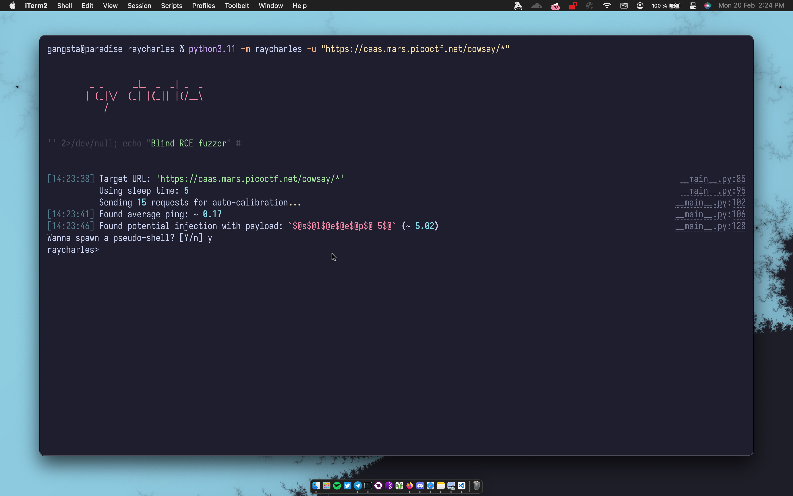

## Ray Charles 😎

A little blind remote command execution fuzzing tool.

## Usage

Clone the repo:

- `git clone https://github.com/traumatism/raycharles.git`

Install dependecies:

- `pip install -r requirements.txt`

Run the scan:

- `python3 -m raycharles --help`

## Credits

- https://www.gnu.org/software/bash/manual/bash.html
- https://en.wikipedia.org/wiki/Arbitrary_code_execution
- https://gist.github.com/ecriminal/01c46176ca26c32e76c00d7c4737b1bd the true rce god
- https://book.hacktricks.xyz/linux-hardening/bypass-bash-restrictions